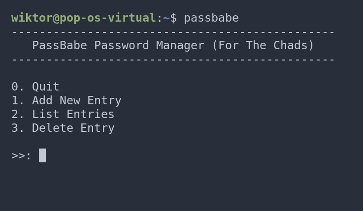

# Passbabe

Passbabe is a password manager, or at least it's supposed to be one. **DO NOT USE IT FOR ANYTHING THAT YOU ACTUALLY WANT TO KEEP SAFE; IT DOESN'T HAVE ENCRYPTION.**
---

---
## What is it?

This baby will create a database file in your `/home/user/.config/passbabe/databases` directory. This file will store your username/password pairs. The program will also create a `passbabe.conf` file that is not being used at the moment. You are able to add database entries, list all database entries, or delete separate database entries.

## What the files do

### main.c

`main.c` prints out a menu for you. You choose an option by selecting a number and pressing enter. Your choice goes into the switch statement where a function will be called based on the option you chose. If you choose 0, the program will quit.

### helpers.c

In `helpers.c`, all of the functions are actually defined. At the top, I am:
- Including the libraries that I will need.
- Defining a struct that I will need later on.
- Defining an enum that I will need shortly.

#### get_location()

The `get_location()` function will return the location of the files/directories that I will need in other functions. It does this by getting the home directory of the user running the program. The program is dynamic in that way. The function can take the following arguments:
- `DATABASE_FILE`
- `DATABASE_DIR`
- `CONFIG`
- `PB_DIR`
- `HOME`

These have been defined in the enum at the top of the file. Each argument provides the corresponding location.

#### create_db_dir()

This function will create all of the directories and files that the program will be using. It will create:
- The `~/.config/passbabe` directory.
- The `~/.config/passbabe/databases` directory.
- The `~/.config/passbabe/databases/database.pbdb` file.
- The `~/.config/passbabe/passbabe.conf` file.

#### list_entries()

`list_entries()` will print all of the entries that you have in your database. It uses the `get_location()` function to get the location of the database. It reads the entries into the `Entries` struct and prints them out to the terminal.

#### add_entry()

This function will add the user-defined entry to the database. It will prompt the user three times for:
- The type of entry (e.g., Facebook, Instagram, bank, etc.).
- Username.
- Password.

It will then use `fprintf` to write the user input to the database file.

#### delete_entry()

`delete_entry()` lets the user delete an entry from the database. It basically does the same thing as `list_entries`, which means that it first prints the entries to the screen. Then it asks the user for the index of the entry. After that, it prints all of the entries to a new file, skipping the entry that the user defined.

## What I wanted to do but didn't

- I obviously wanted to add encryption to the database file. However, I found it too time-consuming and difficult given my current skill level.
- I wanted to add password generation. It's not that difficult, so I might add it very soon.
- I wanted the user to be able to create their own databases. I previously added that functionality, which is why I have the config file to store the location of the database. However, I found it too time-consuming for now.
- It would be cool if the passwords didn't actually show on the screen when you type them or when you're just showing your database. However, I found it too difficult for now.
